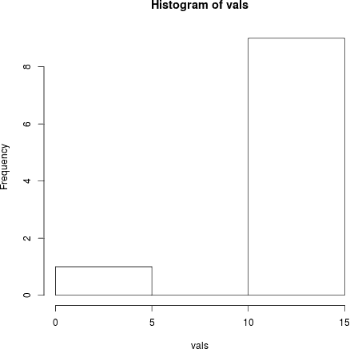

# lldbR

**lldbR** is an R package for using R as a debugger interface via the LLDB API.  It is not a debugger for R; it allows you to use R as a debugger for another program.  See the examples below for more information.


## Installation

The package requires an installation of LLDB.  By default, the package will look for this in `/usr/local`. If your installation is elsewhere, you can specify it via the configure argument `--with-lldb-home`.  

You can install the package from R using any of the packages which can install from GitHub (provided you set `lldbhome` appropraitely; see below for examples)

```r
### Set lldb home
lldbhome <- "--with-lldb-home='/PATH/TO/LLDB'"

### Pick your preference - you only need to run one of these 3
devtools::install_github("heckendorfc/lldbR", args=paste0("--configure-args=\"", lldbhome, "\""))

ghit::install_github("heckendorfc/lldbR", configure.args=lldbhome)

remotes::install_github("heckendorfc/lldbR", configure.args=lldbhome)
```

Alternatively, you can download the latest [here](https://github.com/heckendorfc/lldbR/archive/master.zip) and install it from the command line as follows:

```bash
wget https://github.com/heckendorfc/lldbR/archive/master.zip
unzip master
R CMD build lldbR-master

R CMD INSTALL lldbR_1.0.tar.gz --configure-args="--with-lldb-home='/PATH/TO/LLDB'"
```


#### FreeBSD
Install devel/llvm38 (or other version) with the LLDB knob enabled using ports or pkg. You may then follow the instructions above using `/usr/local/llvm38` for the lldb-home path.


#### Ubuntu 16.04
Because we can't have nice things, out of the box liblldb is not set up correctly. You'll need to link `liblldb.so` to the appropriate `liblldb-VERSION.so`.  Here's an example of what you might do:

```bash
sudo apt-get install lldb liblldb-3.8-dev
sudo ln -f -s /usr/lib/x86_64-linux-gnu/liblldb-3.8.so /usr/lib/llvm-3.8/lib/liblldb.so
```

If you wish to install from R, then your `lldbhome` variable (as in the above) would be:

```r
lldbhome <- "--with-lldb-home='/usr/lib/llvm-3.8/'"
```

Or if you're installing from the command line:

```bash
R CMD INSTALL lldbR_1.0.tar.gz --configure-args="--with-lldb-home='/usr/lib/llvm-3.8/'"
```


#### Other NIX Platforms
The installation should go similarly to the examples above.  If you can provide more explicit details for one now shown here, please consider submitting a pull request.


## Package Use

Say we have a file `/tmp/test.c` that looks like:

```c
#include <stdlib.h>

int main(){
  int i;
  double *x = malloc(10 * sizeof(*x));
  
  for (i=1; i<10; i++){ // oopsie!
    x[i] = 15.0;
  }
  
  // imagine we do things here
  
  free(x);
  return 0;
}
```

If we build this as usual with something like `clang -g -o test /tmp/test.c`, then we can debug this from R using lldbR:

```r
library(lldbR)
lldb.load("/tmp/test")
lldb.breakline("/tmp/test.c", 10)
lldb.run()

lldb.expr("x", 0)
## [1] 0
lldb.expr("x", 1)
## [1] 15
lldb.expr("x[1]") # same as above
## [1] 15
```

We can also do more interesting things, like take a histogram of the first 10 elements of the array:

```r
vals <- lldb.expr("x", 0, 10)
hist(vals)
```

Which gives the expected histogram:


